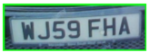

# Number Plate detector
This script demostrates a number plate detector which detects the number plates on a vehicle and enables the user to save these number
plates. It is implemented using haarcascade files, OpenCV and numpy Python libraries.

## Further info
### 🗂️ Project Structure
- 🧩 haarcascade_russian_plate_number.xml : XML file containing the trained model for detecting Numberplates.
- 🗒️ num_plate_detection.py : Python file containing the code to read, display and save the Camera input.

## 📚 Tech Stack
- **Programming Language:** Python
- **Frameworks & Libraries:** OpenCV, numpy.

### 🛠️ Installation & Setup
- Install the Opencv library using the command 

    ```bash
    pip install opencv-python
    ```
- Numpy should be installed automatically along with opencv as its is a pre-requisite, if not install the numpy library using the command

    ```bash
    pip install numpy
    ```

### 📝 Inputs
- An image containing the number plate must be held in front of the laptop camera     

### ⚙️ Usage
- When this script is executed in python it opens up the laptop camera and when an image is placed in the camera's field of view, the
number plate is detected and is marked with labelling. 
- The user also has the option to save the number plate image to a local directory by pressing the 's' key on the keyboard. 
- Upon successfully saving the image, the user is notified with a 'Scan saved' message on the screen. The images are saved in a folder called *'images'*
in the current working directory.

### 📊 Output
- Image of the number plate with a rectangualr border around

    <details>
        <summary>Example Output</summary>
        
    </details>

## 🤝 Contributing
Pull requests are welcome. For major changes, please open an issue first to discuss what you would like to change.

## ✒️ Author
**Harish Havnur Sangappa** – [GitHub](https://github.com/hhavnursangappa) | [LinkedIn](https://linkedin.com/in/harish-havnur-sangappa) | [Website](https://digitalresume-j4ae.onrender.com)

## 📜 License
This project is licensed under the MIT License - see the [MIT](https://choosealicense.com/licenses/mit/) file for details.


