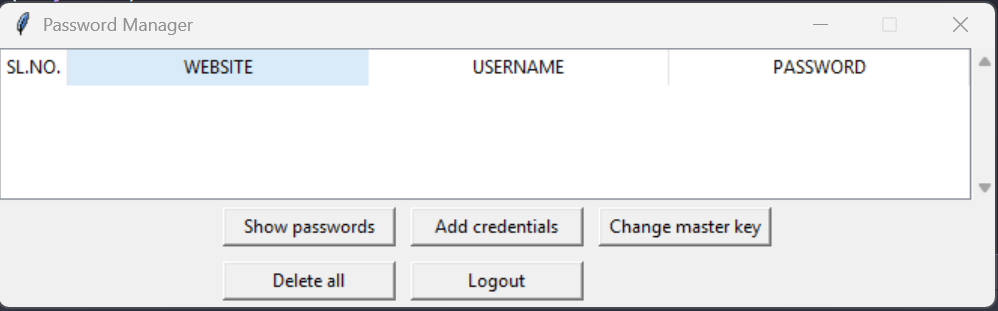

# Password Manager

This application allows users to securely store, update, delete, and copy usernames and passwords for various websites. Access to the vault is protected by a single master key that the user must remember.

## Further info
### 🗂️ Project Structure
- ⚡ password_manager.exe : Executable thats boots up the password vault.
- 🗒️ sql_setup.py : Python script containing the fucntions for SQL database setup and interaction between the tool and the database.
- 🗒️ user_interface.py : Python script for the user interface.

## 📚 Tech Stack
- **Programming Language:** Python
- **Frameworks & Libraries:** sqlalchemy, tkinter.
- **Databases:** SQLite3

### 🛠️ Installation & Setup
- Open cmd in adminisrator mode 
- Install the sqlalchemy library using the command 

    ```bash
    pip install sqlalchemy
    ```
- `tkinter` is a default library in python. If not available install the openpyxl library using the command

    ```bash
    pip install tkinter
    ```   
## 📸 Screenshots



### ⚙️ Usage
Download / Clone the project to a folder in any desired location on your local machine. Now just run the executable *'password_manager.exe'* to boot the application. If you are opening this for the first time you will have to
create a vault using the *Create Vault* button and set a master password for that vault. If you already have a vault click on *Login*, enter the master password and you are good to go. To update, copy or delete an entry, select
the entry, right click on the data which you want to update, copy or delete and choose the required option from the menu.

### 📊 Output
- output.xlsx : Output excel file generated by the 'Expense_Manager.ipynb' notebook file. Contains the expenses after processing / analysing.

    <details>
        <summary>Example Output</summary>
            <table>
            <tr>
                <th>Date</th>
                <th>Commodity</th>
                <th>Amount</th>
                <th>Category</th>
            </tr>
            <tr>
                <td>2024-01-05</td>
                <td>Grocery Store</td>
                <td>Food</td>
                <td>50.00</td>
            </tr>
            <tr>
                <td>2024-01-10</td>
                <td>Uber Ride</td>
                <td>Travel</td>
                <td>15.00</td>
            </tr>
            <tr>
                <td>2024-01-15</td>
                <td>Electricity Bill</td>
                <td>Utilities</td>
                <td>100.00</td>
            </tr>
            <tr>
                <td>2024-01-20</td>
                <td>Movie Tickets</td>
                <td>Entertainment</td>
                <td>25.00</td>
            </tr>
        </table>
    </details>
&nbsp;
- formatted_output.xlsx : Output excel file generated by the 'Expense_formatter.ipynb' notebook file. Contains the formatted expense data with a pie-chart. <br>

    <details>
        <summary>Example Output</summary>
        
    </details>

## 🤝 Contributing
Pull requests are welcome. For major changes, please open an issue first to discuss what you would like to change.


## ✒️ Author
- **Harish Havnur Sangappa** – [GitHub](https://github.com/hhavnursangappa) | [LinkedIn](https://linkedin.com/in/harish-havnur-sangappa) | [Website](https://digitalresume-j4ae.onrender.com)

## 📜 License
This project is licensed under the MIT License - see the [MIT](https://choosealicense.com/licenses/mit/) file for details.


